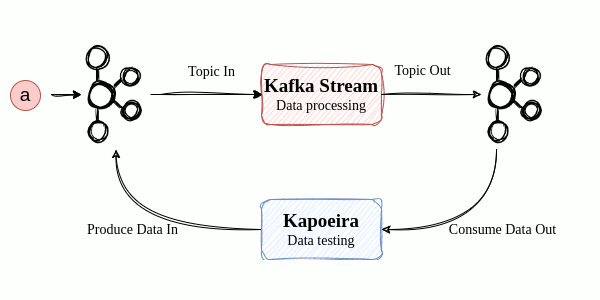
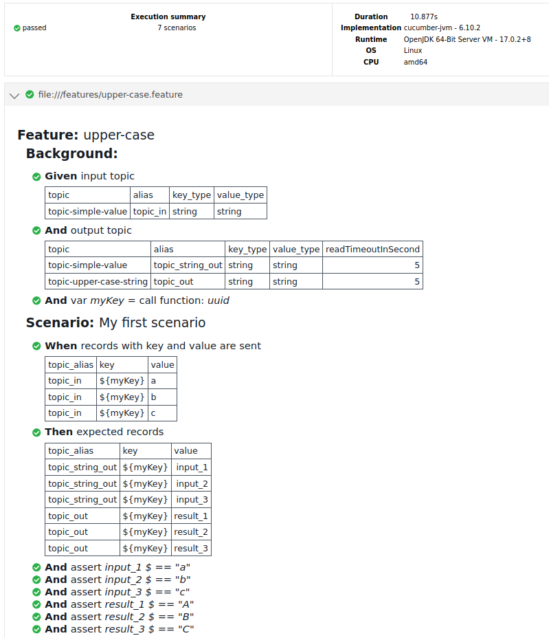
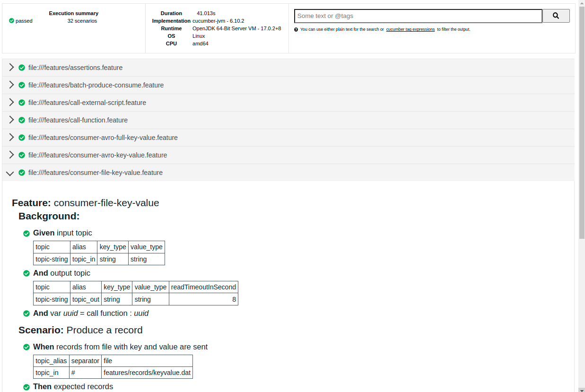

= 
:toc: left
:sectnums:
:caution-caption: :fire:
:important-caption: :exclamation:
:note-caption: :paperclip:
:tip-caption: :bulb:
:warning-caption: :warning:

Dockerized Integration test tool for Kafka Environment

== Why Kapoeira ?

It is easy to make units tests on a kafka stream (see https://kafka.apache.org/21/documentation/streams/developer-guide/testing.html[Apache Kafka Topology Test Driver^] and https://www.confluent.io/blog/test-kafka-streams-with-topologytestdriver/[Confluent documentation^]) but how to make integration tests ?

Kapoeira has been developed for this purpose.

* https://tech-blog.lectra.com/article/795-discover-kapoeira-our-open-source-solution-test-kafka-streams[Presentation of Kapoeira in Lectra tech blog]
* https://jvauchel.github.io/kapoeira-dance/[Presentation of Kapoeira in conferences]

== Tooling

* Written in scala 2.13
* Built with SBT & Docker
* Based on https://github.com/cucumber/cucumber-jvm-scala[Cucumber Scala^]
* Uses specific Gherkin DSL
* Supports Raw, Json and Avro payloads
* Supports shell scripts for external interactions
* Usable as a simple jar or docker image

== Kapoeira DSL

Feature who tests kafka stream doing "upper case" operation

[source,gherkin]
----
Feature: upper-case
  Background:
    Given input topic
      | topic              | alias    | key_type | value_type |
      | topic-simple-value | topic_in | string   | string     | <1>

    And output topic
      | topic                   | alias            | key_type | value_type | readTimeoutInSecond |
      | topic-simple-value      | topic_string_out | string   | string     | 5                   |
      | topic-upper-case-string | topic_out        | string   | string     | 5                   |  <2>
    And var myKey = call function: uuid

  Scenario: My first scenario
    When records with key and value are sent <3>
      | topic_alias | key      | value |
      | topic_in    | ${myKey} | a     |
      | topic_in    | ${myKey} | b     |
      | topic_in    | ${myKey} | c     |
    Then expected records                    <4>
      | topic_alias      | key      | value    |
      | topic_string_out | ${myKey} | input_1  |
      | topic_string_out | ${myKey} | input_2  |
      | topic_string_out | ${myKey} | input_3  |
      | topic_out        | ${myKey} | result_1 |
      | topic_out        | ${myKey} | result_2 |
      | topic_out        | ${myKey} | result_3 |
    And assert input_1 $ == "a"             <5>
    And assert input_2 $ == "b"
    And assert input_3 $ == "c"

    And assert result_1 $ == "A"
    And assert result_2 $ == "B"
    And assert result_3 $ == "C"
----

<1> Setup your input topics
<2> Setup your output topics
<3> Produce some data in your input topic
<4> Consume data from your output topic
<5> Assert the input and output data

After launching, a report is generated to synthesize the result :

.Kapoeira HTML report

== How to build?

=== Without integration tests

[source,bash]
----
docker build -t kapoeira:latest .
----

=== With integration tests

.start local infra and run integration tests
[source,bash]
----
docker compose --profile test up -d
----

.start local infra only
[source,bash]
----
docker compose up -d
----

.start tests only
[source,bash]
----
docker compose run --rm --name kapoeira-it kapoeira
----

.stop local infra
[source,bash]
----
docker compose down
----

== How to test?

=== In your IDE

Run/Debug this Scala class : link:src/test/scala/com/lectra/kapoeira/FeaturesTestRunner.scala[FeaturesTestRunner]

TODO TestContainers

== How to use?

=== Docker Hub images
https://hub.docker.com/r/lectratech/kapoeira[^]

=== Docker command

.Minimal configuration calling the latest Docker image available on Docker Hub
[source,bash]
----
docker run --rm -ti \
    -v <PATH_TO_YOUR_FEATURES_FOLDER>:/features \
    -v <PATH_TO_YOUR_REPORTS_FOLDER>:/reports \
    -e KAFKA_BOOTSTRAP_SERVERS=<HOST:PORT[,HOST2:PORT2,HOST3:PORT3,...]> \
    lectratech/kapoeira:latest
----

Available Docker volumes::
* `/features`: root Kapoeira folder (sub-folders can be defined)
* `/reports`: folder containing Junit generated reports (`kapoeira-report.html`, `kapoeira-report.json`, `kapoeira-report.xml`)
* `/conf`: folder with extra configuration files
* `/var/run/docker.sock` : docker-cli is installed in Kapoeira, so you can set `-v /var/run/docker.sock:/var/run/docker.sock` for calling Docker commands into Kapoeira

Available environment variables::
* `KAFKA_BOOTSTRAP_SERVERS`: Kafka broker host & port list; default: `localhost:9092`
* `KAFKA_USERNAME`: Kafka broker username for configuration having user authentication; default: empty string
* `KAFKA_PASSWORD`: Kafka broker password for configuration having user authentication; default: empty string
* `KAFKA_SCHEMA_REGISTRY_URL`: Schema Registry URL for AVRO/Json Schema contents (on Record Key or Value); default: `http://localhost:8081`
* `KAFKA_SCHEMA_REGISTRY_BASIC_AUTH_CREDENTIALS_SOURCE`: Basic authentication mode for Schema Registry, `USER_INFO` for Confluent Cloud Schema Registry; default: empty string (no basic authentication)
* `KAFKA_SCHEMA_REGISTRY_KEY`: Schema Registry API key if Basic authentication is enabled
* `KAFKA_SCHEMA_REGISTRY_SECRET`: Schema Registry API secret if Basic authentication is enabled
* `KAFKA_CONSUMER_GROUP_ID`: Kafka consumer group id for any created consumers; it is only a prefix if `KAPOEIRA_CONSUMER_GROUP_ID_UNIQUE_SUFFIX` is set to `true`; default: `kapoeira`
* `KAPOEIRA_CONSUMER_GROUP_ID_UNIQUE_SUFFIX`: Boolean for adding a unique suffix (`-<hostname>-<uuid>`) for each created consumer; default: `true`
* `KAPOEIRA_THREADS`: number of threads used by Cucumber; default: `8`
* `KAPOEIRA_LOGGING_LEVEL`: Logback level for Kapoeira logs; default: `INFO`
* `KAPOEIRA_JAVA_SYSTEM_PROPERTIES`: for overriding any properties; default: empty string
** Example: `-Dkafka.boostrap.servers=foo:9092 -Dkafka.consumer.group.id=bar`
* `CONFIG_FILE`: file defining a set of Kafka (common/consumer/producer) properties (see: https://docs.confluent.io/platform/current/installation/configuration/index.html[here^] for available properties) or Kapoeira properties; default: `application.conf`
** Available files (click on the file name for more details):
*** link:src/main/resources/application.conf[`application.conf`^]: default one having no security configuration
*** link:src/main/resources/application-sasl-plaintext-plain.conf[`application-sasl-plaintext-plain.conf`^]
*** link:src/main/resources/application-sasl-plaintext-scram-sha256.conf[`application-sasl-plaintext-scram-sha256.conf`^]
*** link:src/main/resources/application-sasl-plaintext-scram-sha512.conf[`application-sasl-plaintext-scram-sha512.conf`^]
*** link:src/main/resources/application-sasl-ssl-plain.conf[`application-sasl-ssl-plain.conf`^]
*** link:src/main/resources/application-sasl-ssl-scram-sha256.conf[`application-sasl-ssl-scram-sha256.conf`^]
*** link:src/main/resources/application-sasl-ssl-scram-sha512.conf[`application-sasl-ssl-scram-sha512.conf`^]
** You can create your own configuration file `application-custom.conf`, containing or not environment variables, like that:

.Example of `application-custom.conf`
[source, hocon]
----
include "application.conf"

kafka {
    # common properties
    security.protocol = "..."
    sasl.xxx = ${MY_ENV_VAR}
    ...
    # consumer properties
    consumer {
      ...
    }
    # producer properties
    producer {
      ...
    }
}

----

.How to call a custom configuration file
[source,bash]
----
docker run --rm -ti \
    -v <PATH_TO_YOUR_FEATURES_FOLDER>:/features \
    -v <PATH_TO_YOUR_REPORTS_FOLDER>:/reports \
    -v <PATH_TO_YOUR_CONF>:/conf \
    -e KAFKA_BOOTSTRAP_SERVERS=<HOST:PORT[,HOST2:PORT2,HOST3:PORT3,...]> \
    -e CONFIG_FILE=application-custom.conf \
    -e MY_ENV_VAR=foo \
    lectratech/kapoeira:latest
----

== Syntax Guide

=== Features and Background

When you want to create a test, you should start by creating a Feature.
The start of your test file will have to begin with the key word ``Feature`` and then a name of that feature :

[source,language=gherkin]
----
Feature: producer-key-value
----

Then, you have to setup the background of your test.
This is important, especially for kafka, has you will use topics, and maybe avro or json schema.

[source,language=gherkin]
----
Background:
  ... # background declarations
----

==== Input Topics

First you need to declare the topics that you want to push data into.
This is done by declaring  ``Given input topic`` +
Then you have to had a table that will contain the details of those topics, one line per topic :

[source,language=gherkin]
----
Given input topic
| topic        | alias    | key_type | value_type |
| topic-string | topic_in | string   | string     |
----

topic:: The actual name of the topic you want to push data
alias:: You can put an alias for your topic name and use it later in the test.
This can be convenient to factorize the use of it
key_type:: It specifies the type in which you want to serialize your data when you push a key in your topic.
By default, it will be a string format.
If you want to use avro or JSON, see section <<_avro_and_json_schema>>

value_type:: Same as ``key_type`` but for the value in your topic

==== Output Topics

After you declared your input topics, you need to declare the output topics that will contain the output data that you will assert.
It is pretty much the same as input topics but you need to use the keyword ``output topic``.

[source,language=gherkin]
----
And output topic
| topic        | alias     | key_type | value_type | readTimeoutInSecond |
| topic-string | topic_out | string   | string     | 5                   |
----

The only parameter in addition is ``readTimeoutInSecond`` and it allows you to define the duration the consumer will fetch data from the topic (in seconds).

=== Scenarios and Assertions

Once your background is declared, you can start to write scenarios.
You can write several scenarios in the same test file, and each one will use the same ``Background``

To write a scenario, it is like a ``Feature``, you need to specify the keyword ``Scenario`` then add a name to it.

[source,language=gherkin]
----
Scenario: Produce a record
----

==== When

Then you can use the keywords ``When records with key and value are sent`` to specify what to do with your input topic

[source,language=gherkin]
----
When records with key and value are sent
| topic_alias | key      | value     |
| topic_in    | aTestKey | someValue |
----

topic_alias:: It is the alias of the topic you declared in the ``Background`` part
key:: It is the actual key you want to push into the topic (string format here)
value:: It is the actual value that will be sent to the topic (string format here)

==== Then

Now that your data is pushed in Kafka, you want to assert that data is well produced in an output topic and assert that it is conformed to your expectations.
To do that you need to use the key word ``Then expected records``

[source,language=gherkin]
----
Then expected records
| topic_alias | key      | value  |
| topic_out   | aTestKey | aValue |
----

topic_alias:: Same as the ``When`` part
key:: It is the actual key that you expect in your output topic.
It is very useful in a deployed environment as it will allow you to target a specific record in your output topic.
This way, you will assert one record and not the entire topic.
value:: It is an alias for your record.
Like a name of a variable in a program file.
You will use this alias or name in the assertion part.

==== Assertion

Now that you have the output record, you want to assert it.
The record are always parsed as JSON format, even if the format in the topic was avro or string.
To assert fields and subfileds, you can use the https://github.com/json-path/JsonPath[JsonPath DSL^]

[source,language=gherkin]
----
And assert aValue $ == "someValue"
----

****
Full Example ;

[source,language=gherkin]
----
Feature: producer-key-value

  Background:
    Given input topic
      | topic        | alias    | key_type | value_type |
      | topic-string | topic_in | string   | string     |
    And output topic
      | topic        | alias     | key_type | value_type | readTimeoutInSecond |
      | topic-string | topic_out | string   | string     | 5                   |
    And var uuid = call function: uuid

  Scenario: Produce a record
    When records with key and value are sent
      | topic_alias | key      | value  |
      | topic_in    | aTestKey | someValue |
    Then expected records
      | topic_alias | key      | value  |
      | topic_out   | aTestKey | aValue |

    And assert aValue $ == "someValue"

----
****

=== Avro and JSON Schema

==== Defining format

If you use a Schema registry with avro or JSON schema, then you can add the subject of your schema in your tests.

You can specify them in the ``Background`` with the keywords ``Given subject`` :

[source,language=gherkin]
----
Feature: consumer-avro-key-value

  Background:
    Given subject
      | name                 | alias      | format |
      | kapoeira.avrokeyv1   | avro_key   | avro   |
      | kapoeira.avrovaluev1 | avro_value | avro   |
    And input topic
      | topic              | alias    | key_type | value_type |
      | topic-avrokeyvalue | topic_in | avro_key | avro_value |
    And output topic
      | topic              | alias     | key_type | value_type | readTimeoutInSecond |
      | topic-avrokeyvalue | topic_out | avro_key | avro_value | 10                  |
----

name:: It is the name of the subject that is registered in the Schema Registry.
It will be used to fetch the schema on this url : `+http://KAFKA_SCHEMA_REGISTRY_URL/subjects/SUBJECT_NAME/versions/latest/schema+``
alias:: Same as alias for topics.
It is a name that you will use to define the type of a topic.
format::
* ``avro`` if you use an avro key
* ``json`` if you use a key in json with a verified schema

[IMPORTANT]
====
the subject alias must be used in the ``key_type`` or ``value_type`` when defining topics.
Kapoeira will know that your data should be serialized/deserialized in the right format by looking in the definition of the subject through the alias.
====

==== Serializing /  Deserialization Data

If you want to use avro format, you should write your input data in JSON following this example :

****
Schema

[source,language=json]
----
{
    "type": "record",
    "name": "Avrovaluev1",
    "namespace": "com.lectra.kapoeira",
    "fields": [
        {
            "name": "anInt",
            "type": "int"
        },
        {
            "name": "aString",
            "type": "string"
        },
        {
            "name": "anOptionalString",
            "type": [                  <1>
                "null",
                "string"
            ],
            "default": null
        }
    ]
}
----

Example Data

[source,language=json]
----
{
    "anInt": 1,
    "aString": "myString1",
    "anOptionalString": {
        "string": "test"               <1>
    }
}
----

<1> If your field is nullable, then when setting a value to that field, you must put the type in your JSON
****

=== Produce data from File

==== Value from file

It is possible to put your input data in a separate file.
To use this file, you need to use the key words
``When records from file with value are sent`` and then put the path in the column ``file``

[source,language=gherkin]
----
 Scenario: Produce a record
    When records from file   with value are sent
      | topic_alias | key  | file                       |
      | topic_in    | keyX | features/records/value.dat |
----

Each line in the file will result as the value in a record in kafka, and the key will be the one that is passed in the table for all records

==== Key, value and headers from file

You can also specify a key and headers for every record you want to push from a file.
You need to use the keywords ``When records from file with key and value are sent``
and use the column ``separator``.

[source,language=gherkin]
----
    When records from file with  key  and  value  are sent
      | topic_alias | separator | file                                 |
      | topic_in    | #         | features/records/keyheadersvalue.dat |
----

The separator is a character that you can put between your key, value and your headers on the line in your file.

----
key1_${uuid}#{"qux":42}#{"foo":"bar","baz":42}
----

The key is the first part, then the value, and finally the headers.

=== Assertions

As mentioned before, the records that are read are parsed as JSON, no matter the original format, and can be read using https://github.com/json-path/JsonPath[JsonPath DSL^]

Let's say this is your data :

[source,language=json]
----
{
    "foo": "fooString",
    "fooInt": 42,
    "foos": [
        "item1",
        "item2",
        "item3"
    ],
    "qux": [
        {
            "key1": "toto"
        },
        {
            "key2": "titi"
        }
    ],
    "bar": {
        "baz": [
            "item1",
            "item2",
            "item3"
        ]
    }
}
----

You can assert this json this way :

[source,language=gherkin]
----
Then expected records
    | topic_alias | key   | value  |
    | topic_out   | key1  | aValue |
  And assert aValue $.foo == "fooString"
  And assert aValue $.fooInt == 42
  And assert aValue $.fooDouble == 12.0038 +- 1E-4
  And assert aValue $.foos has size 3
  And assert aValue $.foos == ["item1","item2","item3"]
  And assert aValue $ match object {"foos":["item1","item2","item3"],"bar":{"baz":["item1","item2","item3"]}}
  And assert aValue $ match object {"foos":["item1","item2","item3"]}
  And assert aValue $ match object {"bar":{"baz":["item1","item2","item3"]}}
  And assert aValue $.bar match object {"baz":["item1","item2","item3"]}
  And assert aValue $.bar.baz[0] == "item1"
  And assert aValue $ match exact object {"foo":"fooString","fooInt":42,"foos":["item1","item2","item3"],"qux":[{"key1":"toto"},{"key2":"titi"}],"bar":{"baz":["item1","item2","item3"]}}
  And assert aValue $.bar match exact object {"baz":["item1","item2","item3"]}
  And assert aValue $.qux[?(@.key1!=null)] match object {"key1":"toto"}

----

NOTE: The ``match object`` is useful to assert a subpart of a JSON as it will not check that the objects you are comparing are exactly the same.
If you want to do that, you can use the ``match exact object``, that will check that both objects have the exact same fields (even if they are not ordered).

==== Headers

You can assert headers as well, by adding the column ``headers`` in your expectations

[source,language=gherkin]
----
Then expected records
| topic_alias | key  | headers      | value  |
| topic_out   | key1 | aliasHeaders | aValue |
And assert aValue $ == 42
And assert aliasHeaders $ == {"foo":"bar","baz":"42"}
----

The headers are parsed as a JSON object, so you can assert them like record values

=== Variables and Functions

==== Variables
You can declare variables in your test using the keyword ``var`` in any ``Given`` context in the ``Background`` or in any ``Scenario``

[source,language=gherkin]
----
  Background:
    Given var fooInt = 42

  Scenario: uuid
    Given var foo = bar
    And var foo2 = "bar" #same as foo
----

The variables you declare can be used in other part of your test. They can be accessed by using ``${var}``

[source,language=gherkin]
----
Feature: variables

  Background:

    Given input topic
      | topic        | alias     | key_type | value_type |
      | topic-string | topic_in1 | string   | string     |

    And output topic
      | topic        | alias     | key_type | value_type | readTimeoutInSecond |
      | topic-string | topic_out | string   | string     | 5                   |
    And var uuid = foo1234

  Scenario: variables
    When records from file with  key  and  value  are sent
      | topic_alias | separator | file                          |
      | topic_in1   | #         | features/records/batch1.1.dat |
    Then expected records
      | topic_alias | key             | value |
      | topic_out   | samekey_${uuid} | value |
    And assert value $.FOO == 1_${uuid}
----

==== Functions

There are some functions integrated in Kapoeira. You can call one by using the keyword ``call function`` inside a variable.

You can pass arguments after calling the function, and arguments can be variables.
[source,language=gherkin]
----
And var uuid = call function : uuid
And var sleep = call function : sleep 5000
And var sleepDuration = 10000
And var sleepMore = call function : sleep ${sleepDuration}
----

Here is a list of the functions implemented :

uuid:: retrieve an uuid
print:: call a logger.info of the parameters
now:: return OffsetDateTime.now().toString
sleep:: call a thread.sleep. Argument is an int and duration is in milliseconds
uppercase:: put the string in parameter in uppercase
lowercase:: put the string in parameter in lowercase
sha256:: encode a parameter using sha256
sha1:: encode a parameter using sha1

ifeval::[{safe-mode-level} < 20]
[source,language=gherkin]
----
include::src/test/resources/features/call-function.feature[]
----
endif::[]
ifeval::[{safe-mode-level} >= 20]
link:src/test/resources/features/call-function.feature[]
endif::[]

=== Call scripts

You can call external script in your test using the keywords ``call script``. For now, only bash script are executed.

[source,language=gherkin]
----
When call script : /features/scripts/runExternalTool.sh 42
    And call script :
    """
    echo 42
    """
    And var myValue = call script : /features/scripts/runExternalTool.sh 43
    And var myKey = call script :
    """
    echo 44
    """
----

ifeval::[{safe-mode-level} < 20]
[source,language=gherkin]
----
include::src/test/resources/features/call-external-script.feature[]
----
endif::[]
ifeval::[{safe-mode-level} >= 20]
link:src/test/resources/features/call-external-script.feature[]
endif::[]

=== Produce & Consume with batches

We introduced batches in Kapoeira to simulate ordered input data in topics.
It can be useful when you want to test a stream join.
You can specify in what order you push data in input topics and then control the output to assert.

You can use the batches by using the column ``batch`` in your input data and output records. Then, use a number to choose the order to push/read data
[source,language=gherkin]
----
  Scenario: Produce records in multiple topics, using batch mode to keep order between consumption and production
    When records from file with  key  and  value  are sent
      | topic_alias | separator | file                        | batch |
      | topic_in1   | #         | features/records/batch1.dat | 1     |
      | topic_in2   | #         | features/records/batch2.dat | 2     |
    Then expected records
      | topic_alias | key             | value  | batch |
      | topic_out   | samekey_${uuid} | value1 | 1     |
      | topic_out   | samekey_${uuid} | value2 | 2     |
    And assert value1 $.FOO == 1_${uuid}
    And assert value2 $.ANINT == 4
----

== Test Reports

Kapoeira uses the tools from Cucumber to generate reports.

Three output format are generated after every launch ;

* HTML
* JSON
* XML

.Kapoeira HTML report

== Contributing
link:CONTRIBUTING.adoc[]

== Coding guidelines
TODO (scalafmt, ...)

== Code of Conduct
TODO

== Licensing
The code is licensed under link:LICENSE[Apache License, Version 2.0^].

The documentation and logo are licensed under link:cc-by-sa-4.0.LICENSE[Creative Commons Attribution-ShareAlike 4.0 International Public License^].
