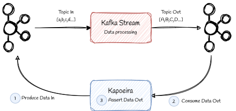

= Kapoeira
:toc: left
:sectnums:

Dockerized Integration test tool for Kafka Environment

== Why Kapoeira ?
It is easy to make units tests on a kafka stream (see https://kafka.apache.org/21/documentation/streams/developer-guide/testing.html[Apache Kafka Topology Test Driver^] and https://www.confluent.io/blog/test-kafka-streams-with-topologytestdriver/[Confluent documentation^]) but how to make integration tests ?

Kapoeira has been developed for this purpose.

== Tooling

* Written in scala 2.13
* Based on https://github.com/cucumber/cucumber-jvm-scala[Cucumber Scala^]
* Uses specific Gherkin DSL
* Supports Raw, Json and Avro payloads
* Supports shell scripts for external interactions
* Usable as a simple jar or docker image

== Kapoeira DSL

Feature who tests kafka stream doing "upper case" operation

[source,gherkin]
----
Feature: My first feature
  Background:
    Given input topic
      | topic    | alias    | key_type | value_type |
      | topic.in | topic_in | string   | string     |

    And output topic
      | topic     | alias     | key_type | value_type | readTimeoutInSecond |
      | topic.out | topic_out | string   | string     | 5                   |

  Scenario: My first scenario
    When records with key and value are sent
      | topic_alias | key   | value |
      | topic_in    | myKey | a     |
      | topic_in    | myKey | b     |
      | topic_in    | myKey | c     |
    Then expected records
      | topic_alias | key   | value    |
      | topic_out   | myKey | result_1 |
      | topic_out   | myKey | result_2 |
      | topic_out   | myKey | result_3 |
    And assert result_1 $ == "A"
    And assert result_2 $ == "B"
    And assert result_3 $ == "C"
----

== How to build?
=== Without integration tests
[source, bash]
----
docker build -t kapoeira:latest .
----
=== With integration tests
.start local infra and run integration tests
[source, bash]
----
docker compose up -d
----
.stop local infra
[source, bash]
----
docker compose down
----
== How to test?

=== In your IDE
Run/Debug this Scala class : link:src/test/scala/com/lectra/kapoeira/FeaturesTestRunner.scala[FeaturesTestRunner]

TODO TestContainers

== How to use?

=== Manual Docker command
.Draft
[source, bash]
----
docker run --rm -ti \
    -v <PATH_TO_YOUR_FEATURES_FOLDER>:/features \
    -v /var/run/docker.sock:/var/run/docker.sock \
    -e KAFKA_BOOTSTRAP_SERVER=<HOST:PORT[,HOST2:PORT2,HOST3:PORT3,...]> \
    -e KAFKA_SCHEMA_REGISTRY_URL=<URL> \
    -e KAFKA_USER=<XXX> \
    -e KAFKA_PASSWORD=<****> \
    -e JAAS_AUTHENT=<true (default) | false> \
    -e LOGGING_LEVEL=<INFO (default) | ERROR | ...> \
    -e THREADS=<8 (default) | ... > \
    <REGISTRY>/kapoeira:<VERSION>
----

[NOTE]
====
* Volume mount on docker.sock only for calling docker command
* KAFKA_SCHEMA_REGISTRY_URL only for AVRO content
====

=== Produce & consume a record

ifeval::[{safe-mode-level} < 20]
[source, language=gherkin]
----
include::src/test/resources/features/producer-key-value.feature[]
----
endif::[]
ifeval::[{safe-mode-level} >= 20]
link:src/test/resources/features/producer-key-value.feature[]
endif::[]

=== Produce from a file

ifeval::[{safe-mode-level} < 20]
[source, language=gherkin]
----
include::src/test/resources/features/producer-file-value.feature[]
----
endif::[]
ifeval::[{safe-mode-level} >= 20]
link:src/test/resources/features/producer-file-value.feature[]
endif::[]

=== Specify keys & headers for a record

ifeval::[{safe-mode-level} < 20]
[source, language=gherkin]
----
include::src/test/resources/features/producer-file-key-value.feature[]
----
endif::[]
ifeval::[{safe-mode-level} >= 20]
link:src/test/resources/features/producer-file-key-value.feature[]
endif::[]

=== Assertions

ifeval::[{safe-mode-level} < 20]
[source, language=gherkin]
----
include::src/test/resources/features/assertions.feature[]
----
endif::[]
ifeval::[{safe-mode-level} >= 20]
link:src/test/resources/features/assertions.feature[]
endif::[]

=== Call functions

ifeval::[{safe-mode-level} < 20]
[source, language=gherkin]
----
include::src/test/resources/features/call-function.feature[]
----
endif::[]
ifeval::[{safe-mode-level} >= 20]
link:src/test/resources/features/call-function.feature[]
endif::[]

=== Call scripts

ifeval::[{safe-mode-level} < 20]
[source, language=gherkin]
----
include::src/test/resources/features/call-external-script.feature[]
----
endif::[]
ifeval::[{safe-mode-level} >= 20]
link:src/test/resources/features/call-external-script.feature[]
endif::[]

=== Produce & Consume Avro records

ifeval::[{safe-mode-level} < 20]
[source, language=gherkin]
----
include::src/test/resources/features/producer-avro-file-key-value.feature[]
----
endif::[]
ifeval::[{safe-mode-level} >= 20]
link:src/test/resources/features/producer-avro-file-key-value.feature[]
endif::[]

=== Produce & Consume with batches

ifeval::[{safe-mode-level} < 20]
[source, language=gherkin]
----
include::src/test/resources/features/batch-produce-consume.feature[]
----
endif::[]
ifeval::[{safe-mode-level} >= 20]
link:src/test/resources/features/batch-produce-consume.feature[]
endif::[]
