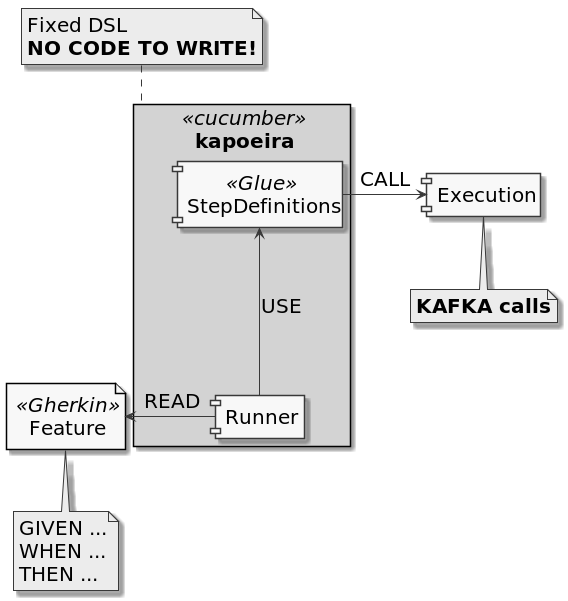

= Kapoeira
:toc:
:sectnums:

Dockerized Integration test tool for Kafka Environment

== Context
* Define Gherkin features respecting Kapoeira DSL defined by these link:src/test/resources/features[examples]
* Kafka records can be defined in Gherkin files or with links to external files (json, avro-json, plain...)
* External commands can be called for assertions (with .sh files for example, calling docker tools if needed)

== How to build?
=== Locally
[source, bash]
----
docker build -t kapoeira:latest .
----

== How to test?

=== In your IDE
Run/Debug this Scala class : link:src/test/scala/com/lectra/kapoeira/FeaturesTestRunner.scala[FeaturesTestRunner]

=== With Docker Locally
.start local infra and run integration tests
[source, bash]
----
docker compose up -d
----

== How to use?

=== Manual Docker command
.Draft
[source, bash]
----
docker run --rm -ti \
    -v <PATH_TO_YOUR_FEATURES_FOLDER>:/features \
    -v /var/run/docker.sock:/var/run/docker.sock \
    -e KAFKA_BOOTSTRAP_SERVER=<HOST:PORT[,HOST2:PORT2,HOST3:PORT3,...]> \
    -e KAFKA_SCHEMA_REGISTRY_URL=<URL> \
    -e KAFKA_USER=<XXX> \
    -e KAFKA_PASSWORD=<****> \
    -e JAAS_AUTHENT=<true (default) | false> \
    -e LOGGING_LEVEL=<INFO (default) | ERROR | ...> \
    -e THREADS=<8 (default) | ... > \
    <REGISTRY>/kapoeira:<VERSION>
----

[NOTE]
====
* Volume mount on docker.sock only for calling docker command
* KAFKA_SCHEMA_REGISTRY_URL only for AVRO content
====

=== Produce & consume a record

[source, language=gherkin]
----
include::src/test/resources/features/producer-key-value.feature[]
----

=== Produce from a file

[source, language=gherkin]
----
include::src/test/resources/features/producer-file-value.feature[]
----

=== Specify keys & headers for a record

[source, language=gherkin]
----
include::src/test/resources/features/producer-file-key-value.feature[]
----

=== Assertions

[source, language=gherkin]
----
include::src/test/resources/features/assertions.feature[]
----

=== Call functions

[source, language=gherkin]
----
include::src/test/resources/features/call-function.feature[]
----

=== Call scripts

[source, language=gherkin]
----
include::src/test/resources/features/call-external-script.feature[]
----

=== Produce & Consume Avro records

[source, language=gherkin]
----
include::src/test/resources/features/producer-avro-file-key-value.feature[]
----

=== Produce & Consume with batches

[source, language=gherkin]
----
include::src/test/resources/features/batch-produce-consume.feature[]
----

